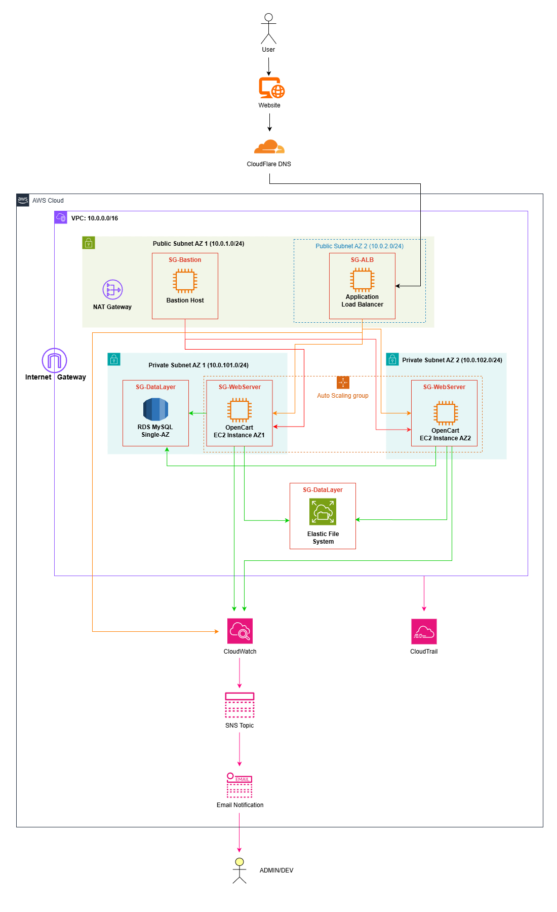

# OpenCart 3.0.5.0 - AWS Terraform Deployment

> 🛒 Production-ready OpenCart e-commerce platform deployed on AWS using Terraform, optimized for AWS Learner Lab constraints.


---

## 🏗️ Architecture Overview



> ⚠️ **Disclaimer:** The architecture diagram above is for illustrative purposes and may not be 100% accurate to the actual Terraform implementation. Some components, configurations, or connections might differ slightly from what is deployed. Please refer to `main.tf` for the exact infrastructure definition.

**Key differences to note:**
- RDS is configured as **Multi-AZ** (not Single-AZ as shown in diagram)
- AWS Backup for EFS is included but not shown in diagram
- S3 bucket for CloudTrail logs is included but not shown in diagram

---

## 📋 Prerequisites

- [Terraform](https://www.terraform.io/downloads) v1.0+
- AWS Learner Lab account with active session
- AWS CLI configured with Learner Lab credentials
- (Optional) Cloudflare account for CDN/SSL

---

## 🚀 Quick Start

### 1. Clone & Configure

```bash
# Navigate to project
cd UAS-5TIMA

# Copy example variables file
cp terraform.tfvars.example terraform.tfvars

# Edit with your values
notepad terraform.tfvars   # Windows
# or
nano terraform.tfvars      # Linux/Mac
```

### 2. Configure Variables

Edit `terraform.tfvars` with your credentials:

```hcl
# Database
db_name     = "opencart_db"
db_username = "opencart_admin"
db_password = "YourSecurePassword123!"

# OpenCart Admin
opencart_admin_username = "admin"
opencart_admin_password = "YourAdminPassword123!"
opencart_admin_email    = "admin@example.com"

# Alerts
alert_email = "your-email@example.com"

# Cloudflare (optional - leave empty if not using)
cloudflare_domain = "shop.yourdomain.com"
```

### 3. Deploy

```powershell
# Initialize Terraform
terraform init

# Preview changes
terraform plan

# Deploy infrastructure (SSH key is auto-exported!)
terraform apply
```

> ✅ **Auto SSH Key Export:** The `bastion-key` file is automatically created with correct permissions after `terraform apply`. No manual key export needed!

### 4. Access Your Store

After deployment (~15-35 minutes for full setup):

```powershell
# Get URLs
terraform output opencart_url
terraform output opencart_admin_url

# SSH to bastion (key is already saved!)
terraform output bastion_ssh_command
# Example: ssh -i bastion-key ubuntu@3.231.168.48
```

---

## 📁 Project Structure

```
UAS-5TIMA/
├── main.tf                  # Main infrastructure code
├── provider.tf              # AWS provider configuration
├── variables.tf             # Variable declarations
├── terraform.tfvars         # Your secret values 
├── terraform.tfvars.example # Template for variables
├── .gitignore               # Protects sensitive files
├── bastion-key              # SSH private key (auto-generated)
├── bastion-key.pub          # SSH public key
│
└── docs/
    ├── images/                      # Architecture diagrams
    ├── OPENCART_ARCHITECTURE.md     # Detailed architecture docs
    ├── Restrictions.md              # AWS Learner Lab limits
    └── Notes.md                     # Issues & solutions log
```

---

## 📚 Documentation Guide

| Document | Description |
|----------|-------------|
| [OPENCART_ARCHITECTURE.md](docs/OPENCART_ARCHITECTURE.md) | Complete architecture breakdown with diagrams, explains each Terraform resource |
| [Restrictions.md](docs/Restrictions.md) | AWS Learner Lab service limits and restrictions |
| [Notes.md](docs/Notes.md) | Issues encountered, challenges faced, and solutions implemented |

---

## 🔧 Infrastructure Components

| Component | Type | Purpose |
|-----------|------|---------|
| VPC | 10.0.0.0/16 | Isolated network |
| Public Subnets | 2 AZs | ALB, Bastion, NAT |
| Private Subnets | 2 AZs | Web servers, RDS, EFS |
| ALB | Application LB | Load balancing + SSL |
| ASG | 2-3 instances | Auto-scaling web tier |
| RDS | MySQL 8.0 Multi-AZ | Database with failover |
| EFS | Shared storage | OpenCart files |
| CloudWatch | Monitoring | Dashboards + 11 alarms |
| AWS Backup | EFS backups | Daily + weekly backups |
| CloudTrail | Audit logs | API activity tracking |

---

## 🔐 Security Features

- ✅ Private subnets for app/data layers
- ✅ Security groups with least privilege
- ✅ RDS encryption at rest
- ✅ EFS encryption at rest
- ✅ HTTPS via Cloudflare (Full SSL mode)
- ✅ Bastion host for SSH access
- ✅ No public IPs on web servers
- ✅ Sensitive variables in terraform.tfvars

---

## 📊 Monitoring & Alerts

CloudWatch alarms notify via email:

| Alarm | Trigger |
|-------|---------|
| CPU High (70%) | Scale up |
| CPU Critical (90%) | Urgent scale up |
| CPU Low (50%) | Scale down |
| ALB Unhealthy Hosts | Instance issues |
| ALB 5XX Errors | Application errors |
| RDS High CPU | Database overload |
| RDS Low Storage | Disk space warning |
| EFS Burst Credits | I/O throttling risk |

---

## 🛠️ Common Commands

```powershell
# View all outputs
terraform output

# Get SSH command (includes current bastion IP)
terraform output bastion_ssh_command

# SSH to bastion (key is auto-saved after apply)
ssh -i bastion-key ubuntu@<bastion-ip>

# Verify your key matches Terraform (fingerprints must match!)
terraform output bastion_key_fingerprint
ssh-keygen -lf bastion-key

# From bastion, SSH to web server (key is pre-installed on bastion)
ssh ubuntu@<private-ip>

# View OpenCart files (from web server)
ls -la /var/www/html/opencart

# Connect to MySQL (from bastion)
mysql -h <rds-endpoint> -u opencart_admin -p

# Destroy infrastructure
terraform destroy
```

---

## ⚠️ AWS Learner Lab Limits

| Limit | Value |
|-------|-------|
| Regions | us-east-1, us-west-2 only |
| Instance Types | nano → large only |
| Max Instances | 9 per region |
| Max vCPUs | 32 total |
| IAM | Use LabRole only |
| RDS Storage | 100 GB max |

> ⚠️ **CRITICAL:** Running 20+ instances = immediate account deletion!

See [Restrictions.md](docs/Restrictions.md) for full details.

---

## 🧹 Cleanup

```powershell
# Destroy all resources
terraform destroy

# Type 'yes' to confirm
```

> ⚠️ RDS creates a final snapshot before deletion. This is intentional for data safety.

---

## 📝 Troubleshooting

### SSH Permission Denied

**Most common cause:** Using an old `bastion-key` file from a previous deployment.

```powershell
# Step 1: Verify key fingerprint matches Terraform
terraform output bastion_key_fingerprint
ssh-keygen -lf bastion-key
# These MUST match! If not, re-export the key:

# Step 2: Re-export key manually (if auto-export failed)
$s = Get-Content terraform.tfstate -Raw | ConvertFrom-Json
$s.outputs.bastion_private_key.value | Set-Content bastion-key -NoNewline
icacls bastion-key /inheritance:r /grant "$($env:USERNAME):R"

# Step 3: Verify correct IP address
terraform output bastion_ssh_command
```

**Linux/Mac users:**
```bash
terraform output -raw bastion_private_key > bastion-key
chmod 600 bastion-key
```

### Instances Not Healthy
```bash
# Check user-data logs on web server
sudo cat /var/log/user-data.log
```

### EFS Mount Failed
- Check security groups allow NFS (port 2049)
- Ensure mount targets exist in private subnets

See [Notes.md](docs/Notes.md) for more solutions.

---

## 👥 Contributors

- Built for AWS Cloud Architecture course

---

## 📄 License

This project is licensed under the [MIT License](LICENSE).

---

*Last Updated: January 5, 2026*
